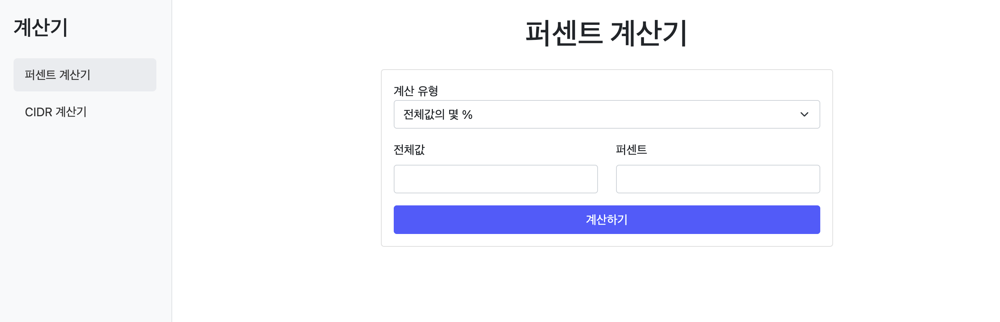

# 퍼센트 계산기

### introduction
평소 자주 사용하는 퍼센트, CIDR 계산기를 구현해 보았습니다.



### hardware
* Raspberry Pi Zero 2W


### Dockerfile

```
# 사용될 베이스 이미지
FROM python:3.9-slim

# 작업 디렉토리 설정
WORKDIR /app

# 의존성 파일을 작업 디렉토리로 복사
COPY requirements.txt requirements.txt

# 의존성 설치
RUN pip install --no-cache-dir -r requirements.txt

# 애플리케이션 소스 복사
COPY . .

# Flask 애플리케이션 실행
CMD ["python", "app.py"]
```

### build & run
```
docker build -t percentage_calculator .
docker run -d --restart=always percentage_calculator
```