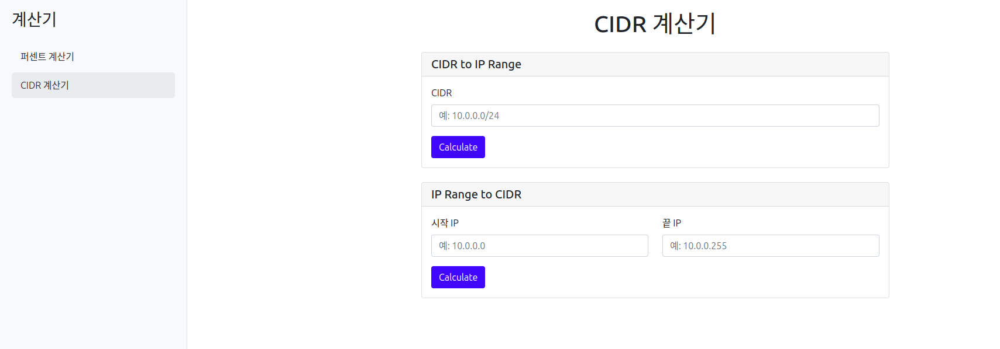

# 퍼센트 계산기

### introduction
퍼센트, CIDR 계산기를 구현해 보았습니다. 이것들은 필요할때 인터넷 검색으로 온라인으로 해당 기능을 제공해 주는 사이트를 찾아서 사용하곤 했었는데, homelab 을 구축하면서 나만의 도구 모음을 만들어보고 싶다는 생각으로 만들게 되었습니다. 

##### 퍼센트 계산기에서 제공하는 기능
- 전체값의 몇 % : 예) 전체값 60000의 20%는 12000
- 부분값의 비율 : 예) 전체값 60000의  부분값 10000은 16.67%
- 증감률 계산  : 예) 이전값 75000, 새로운값 82000 은 9.33% 증가

##### CIDR 계산기 기능
- CIDR to IP Range
- IP Range to CIDR

##### 스크린샷




### hardware
* Raspberry Pi Zero 2W
hardware spec : 1GHz quad-core 64-bit ARM Cortex-A53 CPU and 512MB RAM.

### Dockerfile

```
# 사용될 베이스 이미지
FROM python:3.9-slim

# 작업 디렉토리 설정
WORKDIR /app

# 의존성 파일을 작업 디렉토리로 복사
COPY requirements.txt requirements.txt

# 의존성 설치
RUN pip install --no-cache-dir -r requirements.txt

# 애플리케이션 소스 복사
COPY . .

# Flask 애플리케이션 실행
CMD ["python", "app.py"]
```

### build & run
```
docker build -t percentage_calculator .
docker run -d --restart=always percentage_calculator
```